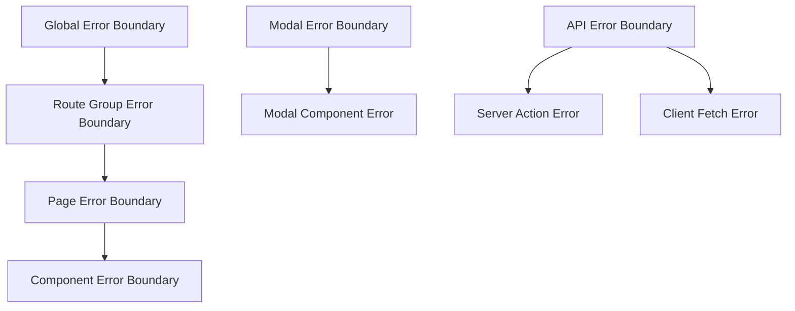

# Design Document

## Overview

현재 Next.js 15 App Router 프로젝트는 기본적인 구조는 잘 갖추어져 있지만, 최신 베스트 프랙티스를
완전히 활용하지 못하고 있습니다. 이 리팩토링은 다음 5개 핵심 영역을 개선합니다:

1. **파일 구조 표준화**: App Router 규칙 완전 준수
2. **라우팅 최적화**: 병렬/인터셉터 라우트 성능 개선
3. **컴포넌트 아키텍처**: Server/Client 경계 최적화
4. **성능 최적화**: 번들 분할과 동적 로딩 강화
5. **타입 안전성**: TypeScript 5.8+ 엄격 모드 완전 적용

## Architecture

### Current State Analysis

**현재 구조의 강점:**

- App Router 기본 구조 구현됨
- `@modal` 병렬 라우트와 `(.)auth` 인터셉터 라우트 활용
- TypeScript 엄격 모드 일부 적용
- 기본적인 성능 최적화 설정

**개선이 필요한 영역:**

- 대부분의 라우트에 `loading.tsx`, `error.tsx` 누락
- 과도한 Client Components 사용 (50+ 파일에서 'use client' 사용)
- 일관성 없는 에러 처리
- 번들 최적화 미흡
- TypeScript 엄격 모드 설정 불완전

### Target Architecture

```mermaid
graph TB
    subgraph "App Router Structure"
        A[Root Layout] --> B[Route Groups]
        B --> C[(app) - Main Routes]
        B --> D[@modal - Parallel Routes]

        C --> E[dashboard]
        C --> F[Projects]
        C --> G[Posts]
        C --> H[Auth]

        D --> I[Intercepted Auth]
        D --> J[Intercepted Modals]
    end

    subgraph "Component Architecture"
        K[Server Components] --> L[Data Fetching]
        K --> M[Static Rendering]

        N[Client Components] --> O[Interactivity]
        N --> P[State Management]

        Q[Shared Components] --> R[UI Library]
        Q --> S[Business Logic]
    end

    subgraph "Performance Layer"
        T[Dynamic Imports] --> U[Route-based Splitting]
        T --> V[Component-based Splitting]

        W[Bundle Optimization] --> X[Package Imports]
        W --> Y[Tree Shaking]
    end
```

## Components and Interfaces

### 1. File Structure Standardization

**Current Issues:**

- `loading.tsx` 파일이 `src/app/posts/[id]/loading.tsx`에만 존재
- `error.tsx` 파일이 루트에만 존재 (`src/app/error.tsx`)
- 라우트별 에러/로딩 처리 불일치

**Target Structure:**

```
src/app/
├── (app)/                     # Main app routes group
│   ├── layout.tsx            # App-specific layout
│   ├── dashboard/
│   │   ├── page.tsx
│   │   ├── loading.tsx       # ✅ Add
│   │   └── error.tsx         # ✅ Add
│   ├── projects/
│   │   ├── page.tsx
│   │   ├── loading.tsx       # ✅ Add
│   │   ├── error.tsx         # ✅ Add
│   │   ├── [id]/
│   │   │   ├── page.tsx
│   │   │   ├── loading.tsx   # ✅ Add
│   │   │   └── error.tsx     # ✅ Add
│   │   └── new/
│   │       ├── page.tsx
│   │       ├── loading.tsx   # ✅ Add
│   │       └── error.tsx     # ✅ Add
│   └── posts/
│       ├── page.tsx
│       ├── loading.tsx       # ✅ Add
│       ├── error.tsx         # ✅ Add
│       ├── [id]/
│       │   ├── page.tsx
│       │   ├── loading.tsx   # ✅ Exists
│       │   ├── error.tsx     # ✅ Add
│       │   └── edit/
│       │       ├── page.tsx
│       │       ├── loading.tsx # ✅ Add
│       │       └── error.tsx   # ✅ Add
│       └── new/
│           ├── page.tsx
│           ├── loading.tsx   # ✅ Add
│           └── error.tsx     # ✅ Add
├── @modal/                   # Parallel routes for modals
│   ├── default.tsx          # ✅ Exists
│   ├── (.)auth/
│   │   └── signin/
│   │       ├── page.tsx     # ✅ Exists (optimized)
│   │       ├── loading.tsx  # ✅ Add
│   │       └── error.tsx    # ✅ Add
│   └── (.)projects/         # ✅ Add new modal routes
│       └── [id]/
│           ├── page.tsx     # ✅ Add
│           ├── loading.tsx  # ✅ Add
│           └── error.tsx    # ✅ Add
├── auth/                    # Full-page auth routes
│   ├── signin/
│   │   ├── page.tsx
│   │   ├── loading.tsx      # ✅ Add
│   │   └── error.tsx        # ✅ Add
│   └── error/
│       ├── page.tsx
│       ├── loading.tsx      # ✅ Add
│       └── error.tsx        # ✅ Add
├── api/                     # API routes
├── layout.tsx               # Root layout
├── page.tsx                 # Home page
├── loading.tsx              # ✅ Add global loading
├── error.tsx                # ✅ Exists
└── not-found.tsx            # ✅ Exists
```

### 2. Component Architecture Optimization

**Server vs Client Component Strategy:**

```typescript
// Server Components (Default)
interface ServerComponentProps {
  // Data fetching props
  searchParams?: { [key: string]: string | string[] | undefined }
  params?: { [key: string]: string }
}

// Client Components (Minimal)
interface ClientComponentProps {
  // Interactive props only
  onAction?: () => void
  state?: any
  children?: React.ReactNode
}
```

**Component Boundary Rules:**

1. **Server Components**: 데이터 페칭, 정적 렌더링, SEO 최적화
2. **Client Components**: 상호작용, 상태 관리, 브라우저 API 사용
3. **Hybrid Pattern**: Server Component가 Client Component를 감싸는 구조

### 3. Performance Optimization Strategy

**Dynamic Import Patterns:**

```typescript
// Route-level code splitting
const DashboardPage = lazy(() => import('./dashboard/page'))
const ProjectsPage = lazy(() => import('./projects/page'))

// Component-level code splitting
const HeavyChart = lazy(() => import('@/components/charts/heavy-chart'))
const RichTextEditor = lazy(() => import('@/components/editor/rich-editor'))

// Conditional loading based on device capabilities
const ConditionalComponent = lazy(() => {
  const isLowEnd = navigator.hardwareConcurrency < 4
  return isLowEnd ? import('@/components/lite-version') : import('@/components/full-version')
})
```

**Bundle Optimization Configuration:**

```typescript
// next.config.ts enhancements
const nextConfig: NextConfig = {
  experimental: {
    optimizePackageImports: [
      // Current packages
      'lucide-react',
      '@radix-ui/react-slot',
      'react-hook-form',
      'zod',
      'clsx',
      'tailwind-merge',
      'next-auth',
      // Additional packages to optimize
      '@tiptap/react',
      '@tiptap/starter-kit',
      'framer-motion',
      'react-query',
      '@prisma/client',
      'date-fns',
      'lodash-es',
    ],
    optimizeCss: true,
    turbo: {
      rules: {
        '*.svg': {
          loaders: ['@svgr/webpack'],
          as: '*.js',
        },
      },
    },
  },
}
```

## Data Models

### Error Handling Models

```typescript
// Standardized error types
interface AppError {
  code: string
  message: string
  details?: Record<string, any>
  timestamp: Date
  route: string
}

interface LoadingState {
  isLoading: boolean
  progress?: number
  message?: string
}

// Route-specific error boundaries
interface RouteErrorBoundaryProps {
  children: React.ReactNode
  fallback?: React.ComponentType<{ error: Error; reset: () => void }>
  onError?: (error: Error, errorInfo: ErrorInfo) => void
}
```

### Performance Monitoring Models

```typescript
interface PerformanceMetrics {
  route: string
  loadTime: number
  bundleSize: number
  coreWebVitals: {
    LCP: number // Largest Contentful Paint
    FID: number // First Input Delay
    CLS: number // Cumulative Layout Shift
  }
}

interface BundleAnalysis {
  totalSize: number
  chunks: Array<{
    name: string
    size: number
    modules: string[]
  }>
  duplicates: string[]
  recommendations: string[]
}
```

## Error Handling

### Hierarchical Error Boundaries



**Error Recovery Strategies:**

1. **Automatic Retry**: 네트워크 에러 시 자동 재시도
2. **Graceful Degradation**: 기능 축소 버전으로 fallback
3. **User Notification**: 사용자 친화적 에러 메시지
4. **Error Reporting**: 개발자용 상세 에러 로깅

### Loading State Management

```typescript
// Unified loading state pattern
interface LoadingStateManager {
  // Route-level loading
  routeLoading: boolean

  // Component-level loading
  componentLoading: Map<string, boolean>

  // Data-level loading
  dataLoading: Map<string, boolean>

  // Methods
  setRouteLoading: (loading: boolean) => void
  setComponentLoading: (id: string, loading: boolean) => void
  setDataLoading: (key: string, loading: boolean) => void
}
```

## Testing Strategy

### Component Testing Approach

```typescript
// Server Component testing
describe('Server Components', () => {
  test('renders with correct data', async () => {
    const component = await ServerComponent({ params: { id: '1' } })
    expect(component).toMatchSnapshot()
  })
})

// Client Component testing
describe('Client Components', () => {
  test('handles user interactions', () => {
    render(<ClientComponent />)
    fireEvent.click(screen.getByRole('button'))
    expect(mockHandler).toHaveBeenCalled()
  })
})

// Route testing
describe('App Router', () => {
  test('parallel routes work correctly', () => {
    // Test modal interception
    // Test fallback behavior
  })
})
```

### Performance Testing

```typescript
// Bundle size testing
describe('Bundle Analysis', () => {
  test('bundle size within limits', () => {
    const analysis = analyzeBundles()
    expect(analysis.totalSize).toBeLessThan(500 * 1024) // 500KB limit
  })

  test('no duplicate dependencies', () => {
    const analysis = analyzeBundles()
    expect(analysis.duplicates).toHaveLength(0)
  })
})

// Performance metrics testing
describe('Performance', () => {
  test('Core Web Vitals within thresholds', () => {
    const metrics = getPerformanceMetrics()
    expect(metrics.LCP).toBeLessThan(2500) // 2.5s
    expect(metrics.FID).toBeLessThan(100) // 100ms
    expect(metrics.CLS).toBeLessThan(0.1) // 0.1
  })
})
```

### Integration Testing

```typescript
// End-to-end route testing
describe('Route Integration', () => {
  test('modal interception works', async () => {
    // Navigate to intercepted route
    // Verify modal opens
    // Test fallback to full page
  })

  test('error boundaries catch errors', async () => {
    // Trigger error
    // Verify error boundary activates
    // Test recovery mechanisms
  })
})
```

## Implementation Phases

### Phase 1: File Structure Standardization

- 모든 라우트에 `loading.tsx`, `error.tsx` 추가
- 파일 명명 규칙 통일
- 디렉토리 구조 정리

### Phase 2: Component Architecture Optimization

- Server/Client 컴포넌트 경계 재정의
- 불필요한 `'use client'` 제거
- 컴포넌트 분할 최적화

### Phase 3: Performance Enhancement

- 동적 임포트 적용
- 번들 최적화 설정 강화
- 코드 분할 전략 구현

### Phase 4: Error Handling & Loading States

- 통합 에러 처리 시스템 구축
- 일관된 로딩 상태 관리
- 사용자 경험 개선

### Phase 5: TypeScript & Testing

- TypeScript 5.8+ 엄격 모드 완전 적용
- 타입 안전성 강화
- 테스트 커버리지 확대
