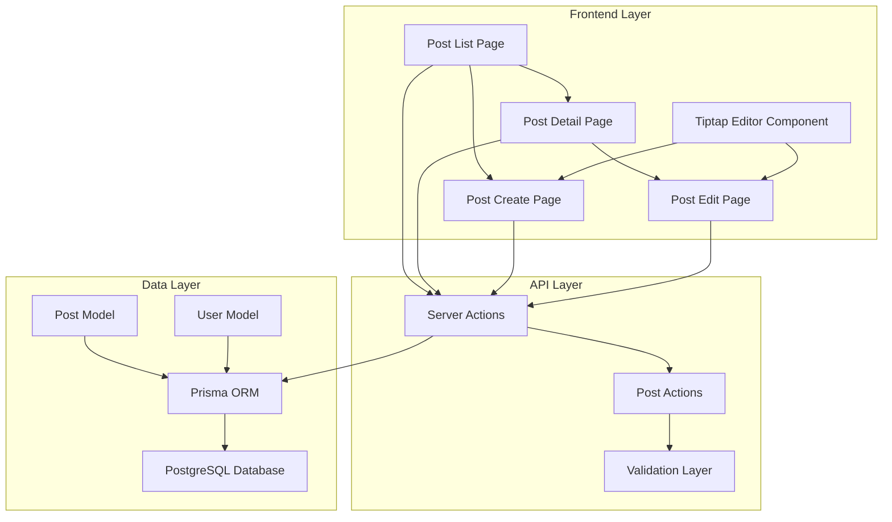

# 설계 문서

## 개요

프로젝트에 Tiptap 에디터를 통합한 완전한 블로그 포스트 시스템을 구현합니다. 이 시스템은 현대적인
리치 텍스트 에디터, 무한 스크롤 기반의 포스트 목록, 그리고 완전한 CRUD 기능을 제공하며, 기존
프로젝트의 아키텍처 패턴과 디자인 시스템을 완벽하게 준수합니다.

## 아키텍처

### 전체 시스템 아키텍처



### 컴포넌트 아키텍처

```mermaid
graph LR
    subgraph "Pages"
        A[/posts] --> B[PostListPage]
        C[/posts/new] --> D[PostCreatePage]
        E[/posts/[id]] --> F[PostDetailPage]
        G[/posts/[id]/edit] --> H[PostEditPage]
    end

    subgraph "Components"
        I[TiptapEditor] --> J[EditorToolbar]
        I --> K[EditorContent]
        L[PostCard] --> M[PostMeta]
        N[InfiniteScroll] --> L
        O[PostForm] --> I
    end

    B --> N
    D --> O
    F --> P[PostContent]
    H --> O
```

## 컴포넌트 및 인터페이스

### 1. Tiptap 에디터 컴포넌트

#### TiptapEditor 컴포넌트

```typescript
interface TiptapEditorProps {
  content: string
  onChange: (content: string) => void
  placeholder?: string
  editable?: boolean
  className?: string
}

interface TiptapEditorRef {
  getContent: () => string
  setContent: (content: string) => void
  focus: () => void
  clear: () => void
}
```

#### 에디터 확장 구성

- **StarterKit**: 기본 텍스트 편집 기능 (Bold, Italic, Strike, Code)
- **Heading**: H1, H2, H3 헤딩 지원
- **BulletList & OrderedList**: 순서 있는/없는 목록
- **ListItem**: 목록 아이템
- **Placeholder**: 플레이스홀더 텍스트
- **History**: Undo/Redo 기능

#### 에디터 툴바 구성

```typescript
interface EditorToolbarProps {
  editor: Editor | null
  className?: string
}

// 툴바 버튼 구성
const toolbarButtons = [
  { type: 'heading', level: 1, icon: 'H1' },
  { type: 'heading', level: 2, icon: 'H2' },
  { type: 'heading', level: 3, icon: 'H3' },
  { type: 'bold', icon: 'Bold' },
  { type: 'italic', icon: 'Italic' },
  { type: 'bulletList', icon: 'List' },
  { type: 'orderedList', icon: 'ListOrdered' },
  { type: 'undo', icon: 'Undo' },
  { type: 'redo', icon: 'Redo' },
]
```

### 2. 포스트 관련 컴포넌트

#### PostCard 컴포넌트

```typescript
interface PostCardProps {
  post: {
    id: string
    title: string
    content: string
    createdAt: Date
    updatedAt: Date
    author: {
      id: string
      name: string
      email: string
      image?: string
    }
  }
  className?: string
}
```

#### PostForm 컴포넌트

```typescript
interface PostFormProps {
  initialData?: {
    title: string
    content: string
  }
  onSubmit: (data: PostFormData) => Promise<void>
  isLoading?: boolean
  submitLabel?: string
}

interface PostFormData {
  title: string
  content: string
}
```

#### InfinitePostList 컴포넌트

```typescript
interface InfinitePostListProps {
  initialPosts: Post[]
  hasMore: boolean
  className?: string
}

interface UseInfinitePostsReturn {
  posts: Post[]
  isLoading: boolean
  isError: boolean
  hasMore: boolean
  loadMore: () => void
}
```

### 3. 페이지 컴포넌트

#### PostListPage

- 무한 스크롤 포스트 목록
- 검색 및 필터링 기능
- 로딩 상태 및 에러 처리
- 반응형 그리드 레이아웃

#### PostDetailPage

- 포스트 상세 내용 표시
- 작성자 정보 및 메타데이터
- 편집/삭제 버튼 (작성자만)
- 소셜 공유 기능

#### PostCreatePage & PostEditPage

- Tiptap 에디터 통합
- 실시간 미리보기
- 자동 저장 기능
- 폼 유효성 검사

## 데이터 모델

### Post 모델 확장

```prisma
model Post {
  id        String   @id @default(cuid())
  title     String
  content   String   @db.Text
  excerpt   String?  @db.VarChar(300)
  slug      String?  @unique
  published Boolean  @default(false)

  // 관계
  authorId  String
  author    User     @relation(fields: [authorId], references: [id], onDelete: Cascade)

  // 메타데이터
  createdAt DateTime @default(now())
  updatedAt DateTime @updatedAt

  // 인덱스
  @@index([authorId])
  @@index([published])
  @@index([createdAt])
  @@map("posts")
}
```

### User 모델 확장

```prisma
model User {
  // 기존 필드들...

  // 새로운 관계
  posts     Post[]

  // 기존 내용 유지...
}
```

### 데이터베이스 마이그레이션 전략

1. **단계별 마이그레이션**
   - Post 모델 추가
   - User-Post 관계 설정
   - 인덱스 생성
   - 기본 데이터 시딩

2. **백워드 호환성**
   - 기존 User 모델 구조 유지
   - 새로운 필드는 옵셔널로 추가
   - 점진적 데이터 마이그레이션

## 에러 처리

### 클라이언트 사이드 에러 처리

```typescript
interface PostError {
  type: 'VALIDATION' | 'NETWORK' | 'PERMISSION' | 'NOT_FOUND'
  message: string
  field?: string
}

interface ErrorBoundaryState {
  hasError: boolean
  error?: PostError
}
```

### 서버 사이드 에러 처리

```typescript
// Server Actions 에러 처리
interface ActionResult<T> {
  success: boolean
  data?: T
  error?: {
    message: string
    code: string
    field?: string
  }
}
```

### 에러 시나리오별 처리

1. **권한 에러**: 인증되지 않은 사용자의 작성/편집 시도
2. **유효성 검사 에러**: 제목 누락, 내용 길이 초과 등
3. **네트워크 에러**: API 호출 실패, 타임아웃
4. **데이터베이스 에러**: 중복 키, 외래키 제약 위반
5. **파일 업로드 에러**: 크기 초과, 지원하지 않는 형식

## 테스팅 전략

### 단위 테스트

1. **컴포넌트 테스트**
   - TiptapEditor 컴포넌트 렌더링
   - 툴바 버튼 동작
   - 폼 유효성 검사

2. **훅 테스트**
   - useInfinitePosts 훅
   - usePostForm 훅
   - useEditor 훅

3. **유틸리티 테스트**
   - 텍스트 요약 함수
   - 날짜 포맷팅
   - 슬러그 생성

### 통합 테스트

1. **API 테스트**
   - 포스트 CRUD 작업
   - 권한 검사
   - 페이지네이션

2. **데이터베이스 테스트**
   - 모델 관계 검증
   - 제약 조건 테스트
   - 마이그레이션 테스트

### E2E 테스트

1. **사용자 플로우 테스트**
   - 포스트 작성 플로우
   - 편집 및 삭제 플로우
   - 목록 탐색 플로우

2. **반응형 테스트**
   - 모바일 디바이스 테스트
   - 태블릿 디바이스 테스트
   - 데스크톱 테스트

## 성능 최적화

### 클라이언트 사이드 최적화

1. **코드 분할**
   - Tiptap 에디터 동적 로딩
   - 페이지별 번들 분할
   - 컴포넌트 지연 로딩

2. **메모이제이션**
   - React.memo로 컴포넌트 최적화
   - useMemo로 계산 결과 캐싱
   - useCallback으로 함수 최적화

3. **이미지 최적화**
   - Next.js Image 컴포넌트 사용
   - 적응형 이미지 크기
   - 지연 로딩

### 서버 사이드 최적화

1. **데이터베이스 최적화**
   - 적절한 인덱스 설정
   - 쿼리 최적화
   - 연결 풀링

2. **캐싱 전략**
   - 포스트 목록 캐싱
   - 사용자 세션 캐싱
   - 정적 콘텐츠 캐싱

3. **페이지네이션**
   - 커서 기반 페이지네이션
   - 적절한 페이지 크기
   - 프리페칭

## 보안 고려사항

### 입력 검증 및 새니타이제이션

1. **클라이언트 사이드**
   - Zod 스키마 검증
   - XSS 방지를 위한 HTML 새니타이제이션
   - CSRF 토큰 검증

2. **서버 사이드**
   - 이중 검증 (클라이언트 + 서버)
   - SQL 인젝션 방지
   - 파일 업로드 검증

### 권한 관리

1. **인증 검사**
   - NextAuth.js 세션 검증
   - 미들웨어 기반 라우트 보호
   - API 엔드포인트 보호

2. **인가 검사**
   - 포스트 작성자 확인
   - 역할 기반 접근 제어
   - 리소스 소유권 검증

## 접근성 (A11y)

### 키보드 네비게이션

1. **에디터 접근성**
   - 키보드 단축키 지원
   - 포커스 관리
   - 스크린 리더 지원

2. **UI 접근성**
   - ARIA 라벨 및 역할
   - 적절한 헤딩 구조
   - 색상 대비 준수

### 스크린 리더 지원

1. **의미론적 HTML**
   - 적절한 HTML 태그 사용
   - 랜드마크 역할 정의
   - 대체 텍스트 제공

2. **동적 콘텐츠 알림**
   - Live regions 사용
   - 상태 변경 알림
   - 에러 메시지 접근성

## 국제화 (i18n)

### 다국어 지원 준비

1. **텍스트 외부화**
   - 모든 UI 텍스트 키-값 분리
   - 에러 메시지 다국어화
   - 날짜/시간 형식 지역화

2. **RTL 언어 지원**
   - CSS 논리적 속성 사용
   - 텍스트 방향 감지
   - 레이아웃 미러링

## 모니터링 및 분석

### 성능 모니터링

1. **Core Web Vitals**
   - LCP (Largest Contentful Paint)
   - FID (First Input Delay)
   - CLS (Cumulative Layout Shift)

2. **사용자 행동 분석**
   - 페이지 뷰 추적
   - 사용자 상호작용 추적
   - 에러 발생 추적

### 로깅 전략

1. **클라이언트 로깅**
   - 에러 로그 수집
   - 사용자 행동 로그
   - 성능 메트릭 로그

2. **서버 로깅**
   - API 요청/응답 로그
   - 데이터베이스 쿼리 로그
   - 보안 이벤트 로그
