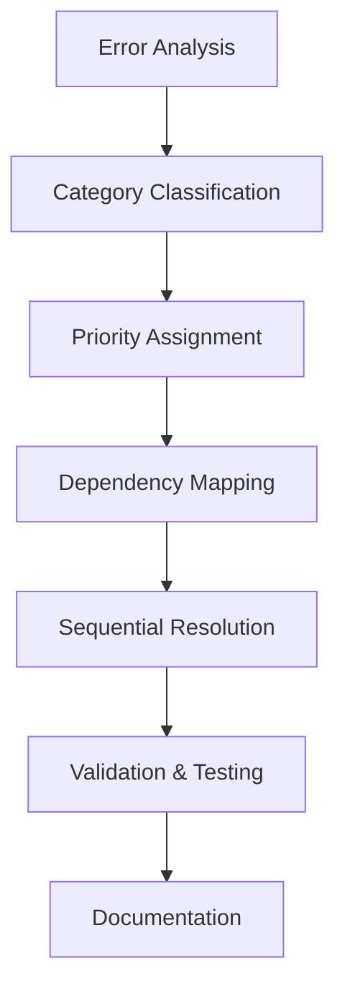

# Design Document

## Overview

Next.js 15 보일러플레이트 애플리케이션의 387개 TypeScript 에러를 체계적으로 해결하기 위한
설계입니다. 에러를 카테고리별로 분류하고 우선순위를 정하여 단계적으로 해결하는 접근 방식을
사용합니다.

## Architecture

### Error Classification System

에러를 다음과 같이 분류하여 해결 우선순위를 정합니다:

1. **Critical Errors (우선순위 1)**: 빌드를 완전히 차단하는 에러
2. **Type Safety Errors (우선순위 2)**: 타입 안전성에 영향을 주는 에러
3. **Import/Export Errors (우선순위 3)**: 모듈 시스템 관련 에러
4. **Generic/Template Errors (우선순위 4)**: 제네릭 타입 관련 에러
5. **Minor Type Errors (우선순위 5)**: 기능에 영향을 주지 않는 경미한 에러

### Resolution Strategy



## Components and Interfaces

### 1. Error Analysis Component

**Purpose**: TypeScript 에러를 분석하고 분류하는 컴포넌트

**Key Functions**:

- 에러 로그 파싱 및 분석
- 에러 카테고리 분류
- 의존성 관계 매핑

### 2. Type Definition Manager

**Purpose**: 타입 정의를 관리하고 수정하는 컴포넌트

**Key Functions**:

- 기존 타입 정의 분석
- 누락된 타입 정의 생성
- 타입 호환성 검증

### 3. Import/Export Resolver

**Purpose**: 모듈 import/export 문제를 해결하는 컴포넌트

**Key Functions**:

- 누락된 export 추가
- 잘못된 import 경로 수정
- 순환 의존성 해결

## Data Models

### Error Classification Model

```typescript
interface TypeScriptError {
  file: string
  line: number
  column: number
  code: string
  message: string
  category: ErrorCategory
  priority: number
  dependencies: string[]
}

enum ErrorCategory {
  CRITICAL = 'critical',
  TYPE_SAFETY = 'type_safety',
  IMPORT_EXPORT = 'import_export',
  GENERIC = 'generic',
  MINOR = 'minor',
}
```

### Resolution Plan Model

```typescript
interface ResolutionPlan {
  errors: TypeScriptError[]
  phases: ResolutionPhase[]
  estimatedTime: number
  riskLevel: 'low' | 'medium' | 'high'
}

interface ResolutionPhase {
  name: string
  errors: TypeScriptError[]
  order: number
  dependencies: string[]
}
```

## Error Handling

### Error Resolution Phases

#### Phase 1: Critical Infrastructure Errors

- 누락된 타입 정의 파일 생성
- 기본 인터페이스 및 타입 수정
- 핵심 모듈의 export/import 문제 해결

#### Phase 2: Type Safety Corrections

- 제네릭 타입 매개변수 수정
- 타입 가드 및 타입 단언 추가
- 인터페이스 호환성 문제 해결

#### Phase 3: Module System Fixes

- 순환 의존성 해결
- 누락된 export 추가
- import 경로 정규화

#### Phase 4: Generic and Template Issues

- 제네릭 타입 제약 조건 수정
- 템플릿 리터럴 타입 문제 해결
- 조건부 타입 수정

#### Phase 5: Minor Type Corrections

- 옵셔널 프로퍼티 처리
- 유니온 타입 정리
- 타입 별칭 최적화

### Error Recovery Strategy

```typescript
interface ErrorRecoveryStrategy {
  // 에러 발생 시 롤백 전략
  rollbackPlan: {
    checkpoints: string[]
    rollbackCommands: string[]
  }

  // 검증 단계
  validation: {
    typeCheck: boolean
    buildTest: boolean
    unitTests: boolean
  }

  // 모니터링
  monitoring: {
    errorCount: number
    resolvedCount: number
    remainingCount: number
  }
}
```

## Testing Strategy

### 1. Incremental Validation

각 해결 단계마다 다음을 검증:

- `tsc --noEmit` 실행으로 타입 체크
- `pnpm build` 실행으로 빌드 테스트
- 기존 단위 테스트 실행

### 2. Regression Testing

타입 에러 해결 후 기능 회귀 방지:

- 핵심 컴포넌트 렌더링 테스트
- API 엔드포인트 응답 검증
- 사용자 플로우 테스트

### 3. Performance Monitoring

타입 체크 및 빌드 성능 모니터링:

- TypeScript 컴파일 시간 측정
- 번들 크기 변화 추적
- 메모리 사용량 모니터링

## Implementation Approach

### 1. Automated Error Detection

```bash
# 에러 분석 스크립트
pnpm type-check 2>&1 | tee typescript-errors.log
node scripts/analyze-typescript-errors.js
```

### 2. Batch Processing

에러를 배치로 처리하여 효율성 증대:

- 파일별 에러 그룹핑
- 의존성 순서에 따른 처리
- 병렬 처리 가능한 에러 식별

### 3. Continuous Validation

각 수정 후 즉시 검증:

- 파일 저장 시 자동 타입 체크
- Git pre-commit 훅으로 검증
- CI/CD 파이프라인 통합

## Risk Mitigation

### 1. Breaking Changes Prevention

- 기존 API 인터페이스 유지
- 하위 호환성 보장
- 점진적 마이그레이션

### 2. Rollback Strategy

- Git 브랜치별 체크포인트 생성
- 자동화된 롤백 스크립트
- 에러 발생 시 즉시 복구

### 3. Documentation

- 변경사항 상세 기록
- 타입 정의 변경 이유 문서화
- 향후 유지보수 가이드 작성
